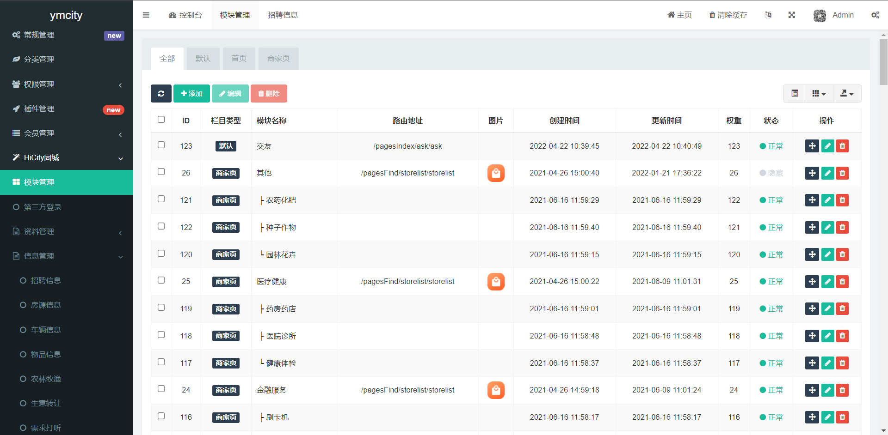

###  开源不易，给个star吧~

[码云仓库： https://gitee.com/zht131/ymcity.git](https://gitee.com/zht131/ymcity.git)

# 应用介绍
ymcity使用uniapp开发的同城便民信息小程序，方便二次开发拓展，后台基于fastadmin,使用插件模式开发，方便安装拓展！
完整前后端源码咨询wx:	 ZHT131572 ！
# 前端体验
联系wx: ZHT131572
# 后台体验账号
地址: [后台管理地址](https://demo.ybym.top/pjohHimKse.php/dashboard?ref=addtabs)
账号: admin
密码: 123456

# 后台截图

# 作者联系方式：

qq:1315723390

wx:ZHT131572

开发交流2群：[点击加uniapp开发交流2群：729308309](https://qm.qq.com/cgi-bin/qm/qr?k=nHoW-RIrsMC86Y7cJHkcGnJEL9HpkUA5&jump_from=webapi)

开发交流1群：[点击加uniapp开发交流1群：971617215](https://qm.qq.com/cgi-bin/qm/qr?k=9ILQir4VGU3XIXm7MtxQYrYShO-b4Zqu&jump_from=webapi)

