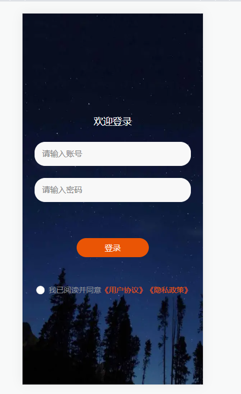
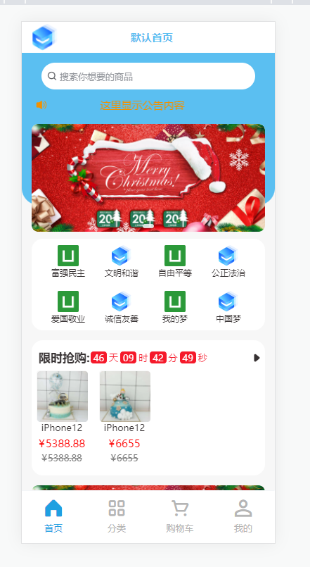
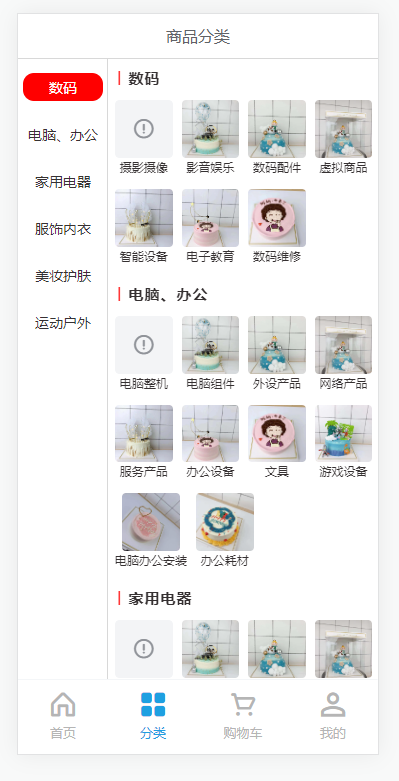
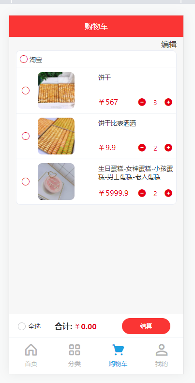
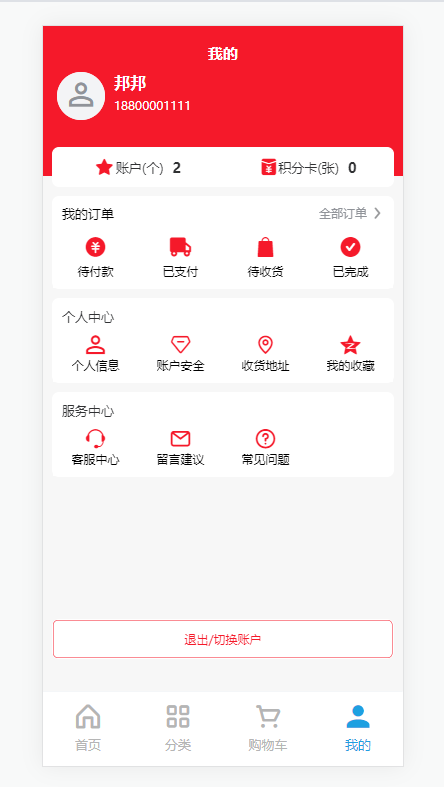
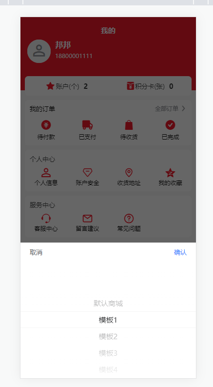
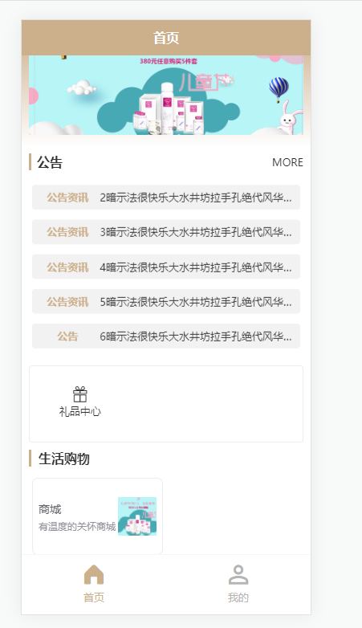
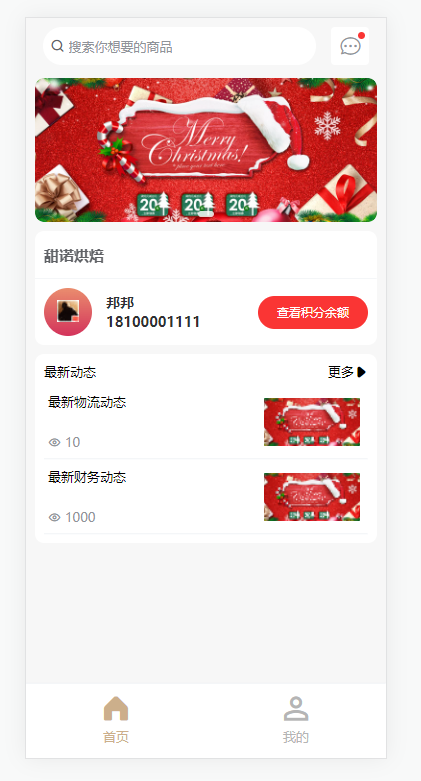
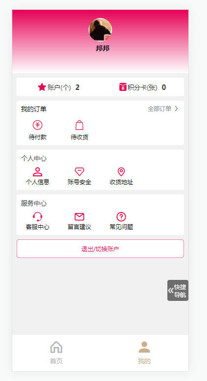
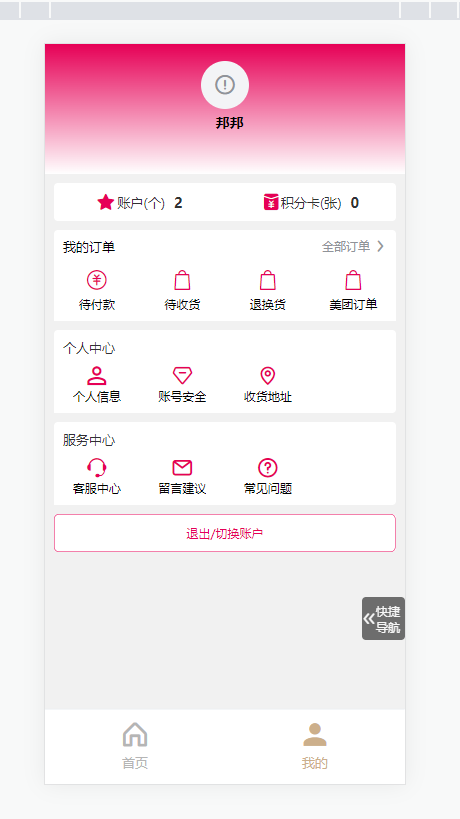

# 页面,tab动态化

## 说明

1. 比较完善的项目结构,采用uview1.x版本完成.
2. 接口数据可以使用uniclound也可以使用自己的后台接口.
3. 底部`tabbar`菜单支持动态配置.`页面栈`支持动态切换
4. tab页面全部采用组件依赖,页面入口都在`/page/index/index`页面中完成依赖
5. 模板切换可在退出登录点击时进行切换

### 目录结构

```
├───common/
│   ├──environment.js  - 服务端环境配置
│   ├──http.api.js	- 接口模块化
│   ├──http.interceptor.js - 请求响应拦截器
├───components/  - 各个页面组件
│   ├──category/  - 类似商品分类组件
│   ├──shopCar/	- 购物车组件
│   ├──common/ -  页面统一依赖的组件
├───pages/ - 页面栈
│   ├───index/index.vue  - 核心入口
│   └───login/login.vue  -登录入口(包含startup,有token缓存可跳过登录页)
│   └───template/   - 动态页面,这里是各个模块自定义的tab页面
├───static/ - 静态文件夹
├───store/ - vuex状态管理
├───util/  - 共用的工具类
└───pages.json -页面栈配置文件
```


### 注意事项
1. npm install 先加载依赖
2. 代码如有报错,请自行修改内部代码,有少量问题存在,不影响体验 .
3. tab的数量,尽量控制在2,3,4能被12整除的情况,5个需要自行修改tab样式.
4. 请重视`pages/index/idnex`页面的阅读,以及`vuex`状态管理字段.
5. 非H5端的模板页面自定义导航栏样式存在部分问题,可自行修正.
6. 性能无大碍,兼容亲测兼容好几十个页面栈交互使用!!!
7. 有问题请联系我:QQ:513489325,微信18174403058


### 预览效果
#### 默认模板
1.  
2.  
3.  
4.  
5.  
6.  

#### 其他模板页面
1.  
2.  
3.  
4.  
5.  
6.  
